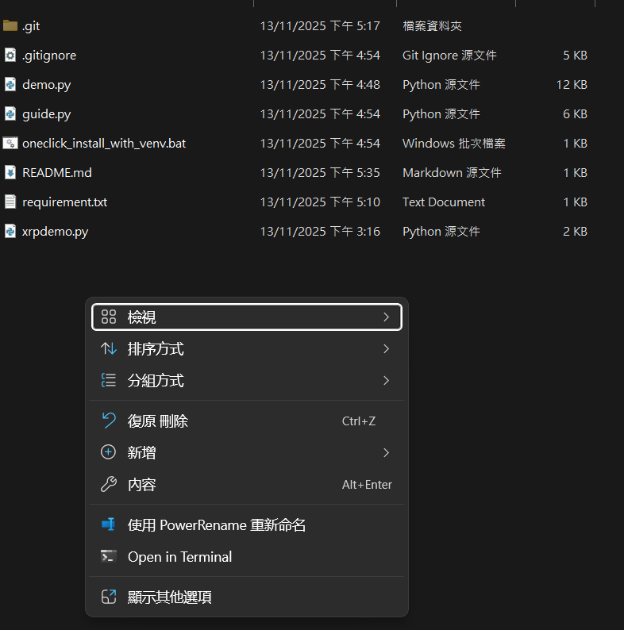

# XRP
It's a automated script that helps you to install the python dependency needed for xrp programs, a remote desktop app, Ruskdesk and allowing the python script runs automatically on start.

# How to use
First, get the file from this repo. Whether it's through `git clone` or `download as zip` are both fine.

Extract the file in one folder. The folder will install every dependency here, so please choose a good place for you to access, e.g. `desktop/xrp`

Right click on the menu, and you'll see the similar menu like image below, click `open in terminal`

Copy the command below and paste it in terminal, then click `enter`
`python guide.py`

After that, the script will help you to install everyone you need. Remember to press button "y" on keyboard when following sentence appears:
> - This script will install software and configure your system. Continue? (y/n): 
> - Venv will be installed at current bat location, press y to continue process

After all things are installed. Open Rustdesk, open setting through this button:

Go to security page, and click `unlock security setting` on top, click yes if it asks you for administrator previllage.

Scroll down, set yourself a permanent password at `password` field. Remember it, that's the key for you to connect to your xrp.
After that, scroll to the most bottom, find `Enable direct IP access` and check it.

Now you can go to your desktop, and access your device through it's ip.